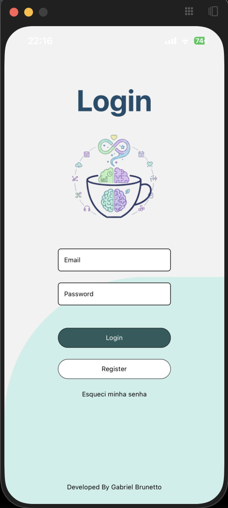
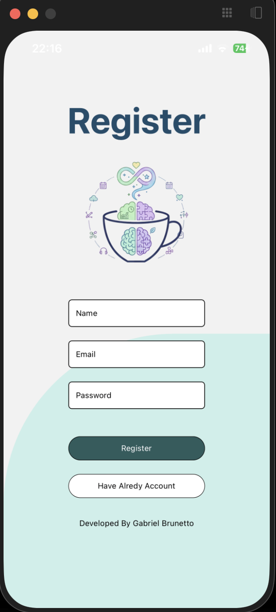
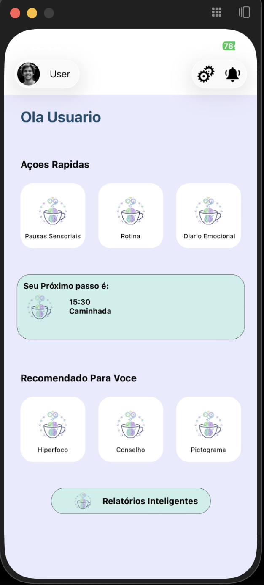
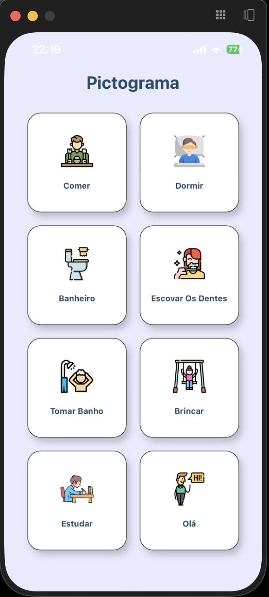

# TEAPP

App mobile de apoio a pessoas com Transtorno do Espectro Autista (TEA).

> 🔒 Código-fonte privado — disponível mediante solicitação.
> 📩 Contato: [LinkedIn](https://www.linkedin.com/in/gabriel-brunetto) · gabibq@yahoo.com.br

---

## O problema

Pessoas com TEA frequentemente enfrentam dificuldades em rotinas diárias, comunicação
e regulação sensorial — e as ferramentas digitais de apoio existentes costumam ser
genéricas ou pouco acessíveis. O TEAPP nasceu como TCC (trabalho de conclusão de curso)
com um objetivo direto: construir uma ferramenta real, com arquitetura de produção,
para apoiar essa rotina de forma acessível e centrada no usuário.

Não é um projeto de tutorial. É um problema real, com usuários reais em mente,
arquitetura pensada para escalar e decisões técnicas documentadas do início ao fim.

## Stack

| Camada | Tecnologias |
|---|---|
| Frontend | React Native + Expo |
| Backend | NestJS + PostgreSQL |
| Infraestrutura | Docker → AWS (ECS/Fargate, ALB, RDS) |
| CI/CD | GitHub Actions |

## Arquitetura

O projeto foi desenhado com uma evolução em 5 fases, saindo de um ambiente local
em Docker até uma arquitetura completa na AWS:

1. **Local** — containers Docker isolados (frontend, backend, banco) para desenvolvimento
2. **Docker Compose** — orquestração local dos serviços, rede interna entre containers
3. **Containerização para deploy** — build de imagens prontas para produção
4. **AWS (fase inicial)** — ECS/Fargate rodando os containers, RDS gerenciando o PostgreSQL
5. **AWS (produção)** — ALB distribuindo tráfego, arquitetura preparada para escala horizontal

*(ou link para vídeo curto, se preferir hospedar fora do repo)*

## Destaques técnicos

- **Contract-first mindset**: experiência prévia em QA testando contratos de API
  (Postman/Newman) aplicada diretamente ao design dos endpoints do backend
- **Infraestrutura documentada e evolutiva**: cada fase da arquitetura foi mapeada
  antes da implementação, não construída por tentativa e erro
- **Full-stack real**: frontend mobile, backend, banco de dados e infraestrutura
  cloud sob a mesma responsabilidade, do design ao deploy
- **Fundamentação teórica**: parte do trabalho acadêmico (TCC) incluiu pesquisa
  sobre TEA, tecnologia assistiva e Design Centrado no Usuário, aplicada diretamente
  nas decisões de UX do app

## Capturas de tela

| Tela De Login | Tela De Registro | Tela Principal | Pictograma |
|---|---|---|
|  |  |  |   |

## Sobre o autor

Gabriel Brunetto — Full Stack Developer, com base em QA técnico (Telefônica/Vivo).
Estudante de Ciência da Computação (URI). AWS Certified Cloud Practitioner.

[LinkedIn](https://www.linkedin.com/in/gabriel-brunetto) · [GitHub](https://github.com/Gabriel-Brunetto)